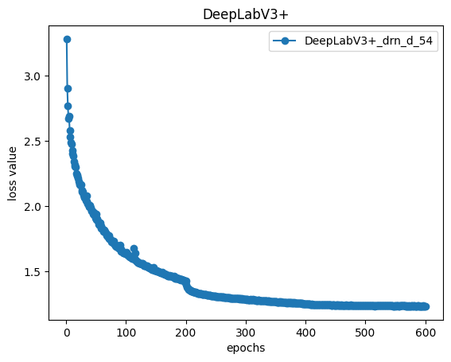

# 24.05.13(Mon)
- 모델 결정
  - DeepLabV3+(drn_d_54)

1. 학습 이미지 색감 조정(노란빛 -> 푸른빛)

2. 클래스별 loss weight값 설정
- 클래스별 존재 비율: [13.91, 0.73, 17.64, 0.97, 0.61, 0.28, 0.71, 13.17, 21.06, 0.14, 0.1, 8.36, 22.33]
- 클래스별 weight값: [0.07, 1.37, 0.06, 1.03, 1.64, 3.57, 1.41, 0.08, 0.05, 7.14, 10.00, 0.12, 0.04]

3. loss function 변경(CrossEntropyLoss -> DiceCELoss(Jaccard))
- 에폭수: 600
- validation mIoU값
  - 0.4030

- validation pred mask

## Issue
- loss function 변경 및 weight값 설정 이후 성능이 0.42 -> 0.40으로 낮아짐
