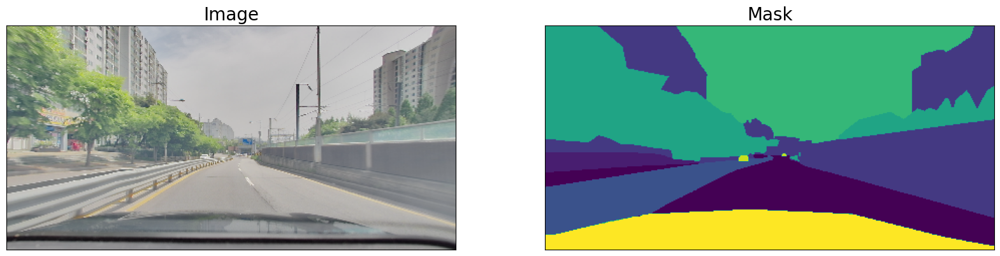
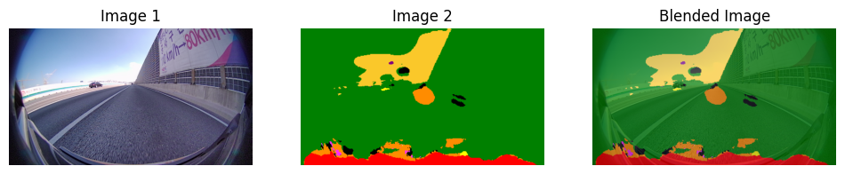

# 모델 학습 테스팅
---
- [x] 모델 선택 (Unet)
- [x] 데이터 셋 연결
- [x] 학습
- [x] 결과(Output) 출력(Accuracy등)
- [x] 결과(rle image) 출력

# 개발 환경 세팅
---
- [x] 플랫폼 선택(MLflow)
- [x] 모델 학습 테스팅(로컬환경)

- [x] 테스팅 결과 비교(로컬환경)

# 24.04.01(Mon)
1. 훈련 데이터의 원본 이미지와 mask 이미지 확인

2. 테스트 데이터의 이미지를 base U-Net Model로 돌려 결과데이터(rle_encode로 된 mask값(12개의 클래스) 뽑기
3. mask값을 rle_decode해서 사람이 볼 수 있는 이미지로 만들기
4. mask 이미지(0~12값을 가짐)를 color 이미지로 변환
5. 원본 이미지와 mask 이미지을 합쳐서 어떻게 학습됐는지 한 눈에 확인

