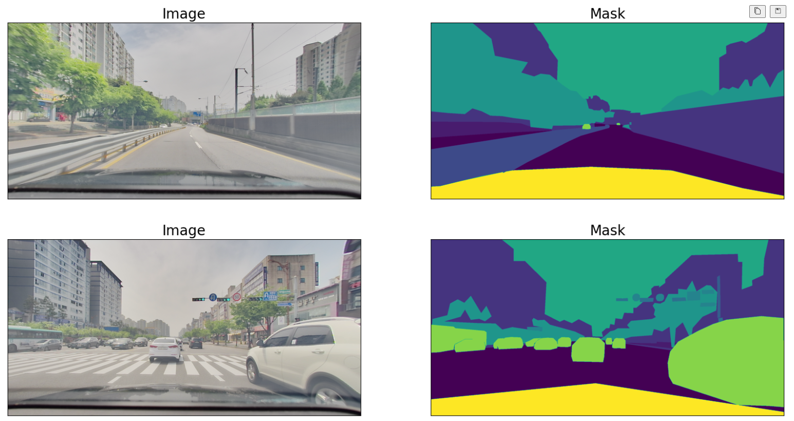
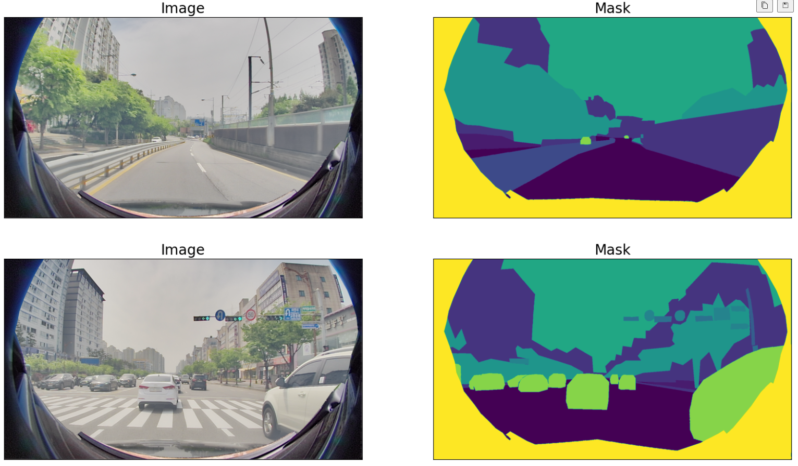

# 24.04.08(Mon)
1. 훈련 데이터의 원본 image와 mask 확인 (2048x1024)

2. image 왜곡(fisheye)
3. image crop 및 사이즈 변경(1920x1080)
4. background 이미지 합성
5. mask 왜곡(fisheye)
6. mask crop 및 사이즈 변경(1920x1080)
7. background mask 합성

