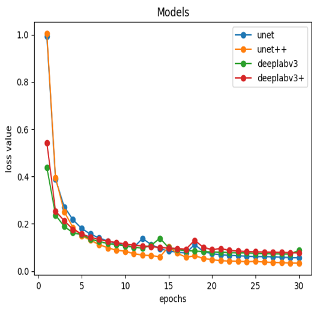
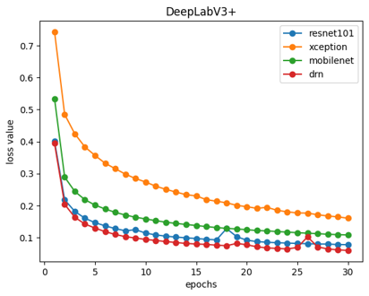
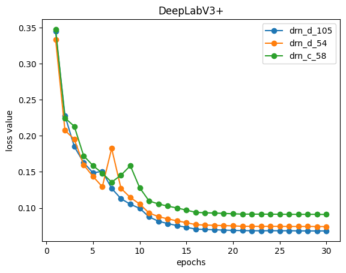

# 24.04.29(Mon)
1. 모델 선정

- validation mIoU값
  - UNet: 0.4034
  - UNet++: 0.4126
  - DeepLabV3: 0.4118
  - DeepLabV3+: 0.4231
    - DeepLabV3+ 선정
2. backbone 선정 (DeepLabV3+)

- validation mIoU / test mIoU 값
  - Xception: 0.3716 / 0.1802
  - Mobilenet: 0.4135 / 0.2158
  - Resnet101: 0.4231 / 0.2930
  - DRN: 0.4340 / 0.3083
    - DRN backbone 선정
3. DRN 세부 설정

- validation mIoU
  - drn_c_58: 0.4207
  - drn_d_54: 0.4261
  - drn_d_105: 0.4190 

## Issue
- S06-603 RTX 3070의 CUDA memory 부족: batch size 타협
